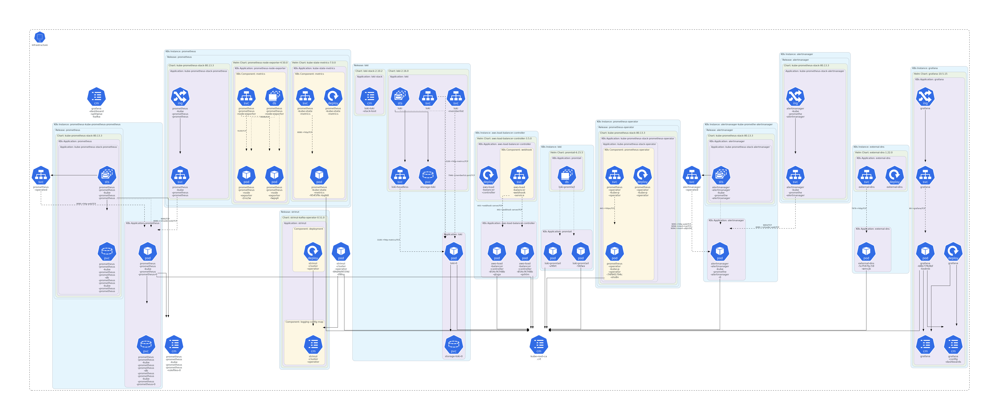
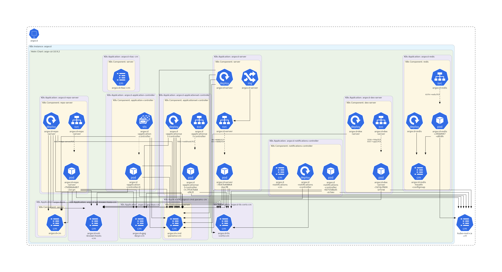
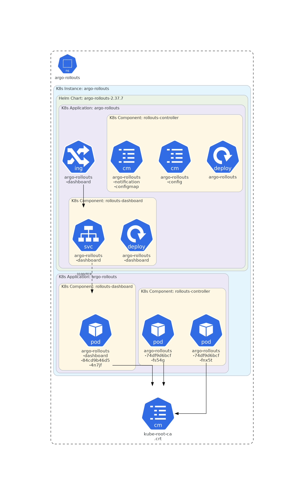
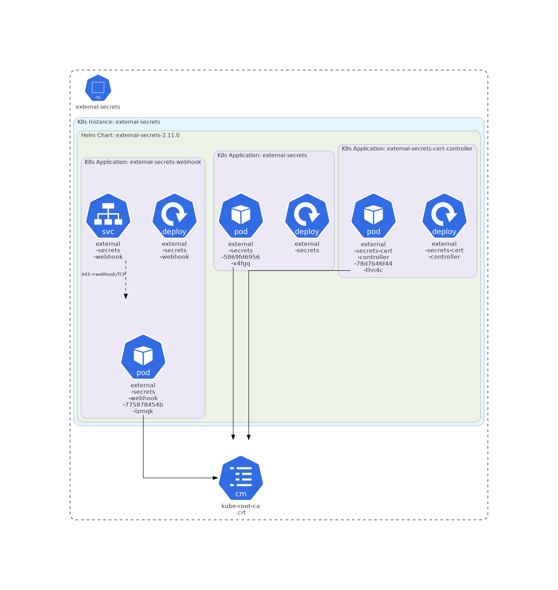

# AWS (Terraform + EKS + Karpenter)

This folder is the AWS counterpart to `Environment/local/` — same Argo CD
app-of-apps idea, but on a real EKS cluster provisioned by Terraform
instead of a local k3d cluster, with Karpenter doing node autoscaling
instead of a fixed k3d node count. It's the Milestone 6 track: real cloud
infra, real cost, real teardown discipline.

## What Gets Bootstrapped

1. An S3 bucket holding every root's Terraform state (native S3 locking, no DynamoDB table)
2. A GitHub Actions OIDC provider + IAM role, trust-scoped to this repo (any branch, plus PRs) — no long-lived AWS credential lives in GitHub secrets anywhere in this project; `prod`-only-from-`main` is enforced separately, at the workflow level (see "GitHub Actions Workflows" below)
3. A registered domain + public Route53 hosted zone + wildcard ACM cert
4. Per environment (`dev`, `prod`), each in its own VPC/EKS cluster:
   - VPC, EKS cluster with EKS access entries (no legacy `aws-auth` configmap), one untainted "bootstrap" managed node group
   - Karpenter, with two capacity profiles (`general`, `batch`) for node autoscaling
   - AWS Load Balancer Controller, `external-dns`, `external-secrets` + a `ClusterSecretStore` backed by AWS Secrets Manager
   - Argo CD, with a root Application pointing at `argocd/apps/<env>` (this repo's AWS equivalent of `Environment/local/argocd/apps/`)

## Layout

```text
Environment/aws/
  global/            # Account-level: state bucket, GitHub OIDC, DNS/cert (see below)
    backend-bootstrap/   # S3 state bucket + the terraform-bootstrap IAM user — manual, by hand, always
    github-oidc/         # OIDC provider + github-actions-terraform role — manual for its first apply, and for any destroy, forever (see "GitHub Actions Workflows" below)
    dns/                 # Hosted zone lookup + wildcard ACM cert — CI-managed once bootstrapped
  models/            # Reusable modules, composed by envs/*
    vpc/, eks/, karpenter/, secrets/, iam-oidc/ (+ irsa-role/ submodule)
  envs/
    us-east-1/         # Region — state key prefix (envs/us-east-1/...) mirrors this path
      dev/
        01-cluster/    # VPC, EKS, Karpenter IAM, Secrets Manager containers, IRSA roles
        02-platform/   # Karpenter/NodePools, ALB controller, external-dns, external-secrets, Argo CD — needs 01-cluster's live cluster
      prod/
        01-cluster/
        02-platform/
  argocd/
    apps/dev/, apps/prod/   # What each env's Argo CD root Application points at — see argocd/apps/README.md for current status
    values/                 # Helm values (e.g. per-env Strimzi values)
  scripts/
    destroy_environment.sh  # Drains Karpenter nodes, then destroys 02-platform then 01-cluster for one env
```

`Environment/resources/splitwise-runtime/base/` (outside this folder) holds the Kafka/producer/loadgen/Kafka-UI manifests shared between local and AWS — local's ingress stays untouched (Traefik + `localtest.me`, no DNS locally); AWS layers its own ALB + `external-dns` ingress on top of the same base.

## Architecture Diagram


Generated straight from `envs/us-east-1/dev/01-cluster`'s actual Terraform code with [TerraVision](https://github.com/patrickchugh/terravision) — not hand-drawn, so it can't drift from what `terraform apply` would actually create. It only covers `01-cluster` (the real AWS resources: VPC, EKS, IAM/IRSA, KMS, Secrets Manager, the Karpenter interruption SQS queue); `02-platform` is almost entirely `helm_release`/`kubectl_manifest` resources — Kubernetes objects, not AWS ones, so a Terraform-parsing tool has nothing to draw there. For what actually runs *inside* the cluster, see the live map below.

To regenerate after a real infra change:

```sh
pip install terravision   # + graphviz, terraform — see the tool's own README
cd envs/us-east-1/dev/01-cluster
terravision draw --source . --outfile /tmp/architecture --format png
# --outfile is a prefix, not the final name -- it actually writes
# /tmp/architecture-aws.dot.png
mv /tmp/architecture-aws.dot.png ../../../../docs/architecture.png
```

### Live cluster map

Not from source code — the actual live cluster, queried at generation time, one diagram per namespace via [KubeDiagrams](https://github.com/philippemerle/KubeDiagrams) (`pip install kubediagrams`; needs Graphviz). Unlike TerraVision above, nothing gets deployed into the cluster for this — it reads whatever `kubectl get ... -o yaml` hands it on stdin and renders directly, no in-cluster component required. `kube-system` (coredns, kube-proxy, the VPC CNI, `ebs-csi`) is excluded — generic EKS plumbing, not specific to this project. `Secret` objects are never fetched at all, not even for structure — only their *names* appear, referenced from whichever ConfigMap/volume points at them, so no secret value is ever piped through a third-party tool.

One combined image across all 5 namespaces technically works but renders as a single 15000px-wide strip (Graphviz lays out unrelated namespace clusters side by side, and there's no direction override this tool exposes) — illegible at any normal size. Splitting per namespace fixed that outright: four of the five need no zooming at all, and even `infrastructure` (the densest namespace by far) is a real, readable diagram rather than a blur.

<details>
<summary><code>splitwise-dev</code> — the app, Kafka, Argo Rollouts blue-green</summary>


</details>

<details>
<summary><code>infrastructure</code> — Prometheus, Grafana, Alertmanager, Loki, controllers</summary>



</details>

<details>
<summary><code>argocd</code> — Argo CD's own components</summary>



</details>

<details>
<summary><code>argo-rollouts</code> — the Rollouts controller and dashboard</summary>



</details>

<details>
<summary><code>external-secrets</code> — the ExternalSecrets operator</summary>



</details>

Two real bugs surfaced getting these to actually connect, not just render:

- **Most Services showed up disconnected at first.** Traced it into KubeDiagrams' own installed script: for any *live* resource (one with a real `metadata.uid`), it matches a Service's selector against **Pod** labels only — never a Deployment/StatefulSet's `spec.template` labels, even though that's a perfectly valid selector target. `Pod` wasn't in the original fetch (trimmed to cut clutter); adding it back fixed all but two Services cluster-wide — and those two (`splitwise-loadgen`'s active/preview Services) are correctly unmatched, since that Rollout is deliberately scaled to 0 and genuinely has no pods.
- **Argo Rollouts and Strimzi's CRDs aren't in KubeDiagrams' built-in kind list.** Fixed with `scripts/kubediagrams/KubeDiagrams.yaml` — the `Rollout` mapping (icon + blue-green active/preview Service edges) is copied verbatim from KubeDiagrams' own `examples/argo/` config; the `Kafka`/`KafkaNodePool`/`KafkaTopic`/`StrimziPodSet` mappings are a minimal addition of my own (icon only, no custom edges — no official config exists for Strimzi yet).

Point-in-time, not evergreen — regenerate after anything in the cluster changes:

```sh
KINDS="deployments,statefulsets,daemonsets,pods,services,ingresses,configmaps,persistentvolumeclaims,rollouts.argoproj.io,kafkas.kafka.strimzi.io,kafkanodepools.kafka.strimzi.io,kafkatopics.kafka.strimzi.io,strimzipodsets.core.strimzi.io"

cd scripts/kubediagrams   # so icons/Rollout.png resolves relative to the config
for ns in splitwise-dev infrastructure argocd argo-rollouts external-secrets; do
  kubectl get $KINDS -n "$ns" -o yaml \
    | kube-diagrams -c KubeDiagrams.yaml -o "../../docs/eks-live-map/$ns" -f png -
done
```

## Prerequisites

- **An AWS account with a valid payment method attached.** Domain registration is a real purchase, and everything under `envs/` incurs real hourly charges once applied.
- **A registered domain you control.** Using `.click` for now (~$3-5/yr, no first-year-vs-renewal price jump — cheapest steady-state option). `.com` is the preferred longer-term choice if this project sticks around — no technical difference between them for this setup, `.com` is just the more standard/recognizable choice once cost stops being the deciding factor.
- Terraform, the AWS CLI, and `kubectl` installed locally.
- **This is a real-money track.** Nothing here runs for free — tear an environment down (`scripts/destroy_environment.sh`) when you're not actively using it.

## Account Bootstrap (manual, one-time, required)

Two roots have an irreducible chicken-and-egg problem: `backend-bootstrap` creates the S3 bucket every other root's state lives in, and `github-oidc`'s first apply creates the OIDC trust relationship every GitHub Actions workflow in this repo authenticates with. Neither has anything to authenticate against yet on a brand-new account, so **both must be applied locally, by hand, before any workflow can touch AWS at all.**

This never needs a long-lived credential sitting anywhere — use whatever session you already have (your own AWS CLI login, IAM Identity Center, or AWS CloudShell in the console, which needs zero local setup):

```sh
cd Environment/aws/global/backend-bootstrap
terraform init
# If the terraform-bootstrap IAM user already exists (the normal case —
# it's whatever identity you're applying with), adopt it instead of
# letting apply fail with EntityAlreadyExists:
terraform import aws_iam_user.terraform_bootstrap terraform-bootstrap
terraform apply

cd ../github-oidc
terraform init
terraform apply
```

Take the `github_actions_role_arn` output from `github-oidc` and set it as the `AWS_ROLE_ARN` repo variable in this repo's GitHub Actions settings — every OIDC-authenticated workflow reads it from there.

**After this one-time step, no workflow in this repo ever needs a stored AWS credential again.** Every GitHub Actions workflow authenticates via the OIDC role this step creates.

Two more steps finish account setup, and — unlike the two above — both can go through CI from here on instead of by hand:

- **Register the domain** (manual either way, via AWS Console → Route53 → Registered domains → Register domain). This has a real recurring cost tied to your payment method, which is why it isn't Terraform — nothing here should silently re-purchase or release a domain. Registering here auto-creates the public hosted zone the next step looks up.
- **`global/dns`** — requests the wildcard ACM cert (`*.<domain>`) both environments' ingress will use, once the domain is registered. Run via `terraform-aws-account-setup.yaml` (`action=apply`), or locally:
  ```sh
  cd Environment/aws/global/dns
  terraform init
  terraform apply -var="domain_name=splitwise.click"
  ```
  `domain_name` is only ever needed here — `envs/us-east-1/dev/01-cluster` reads `hosted_zone_id` straight out of this root's state via `terraform_remote_state` and needs no variable of its own for it.

## GitHub Actions Workflows

Three workflows, each with a distinct job:

| Workflow | Trigger | Does |
|---|---|---|
| `terraform-aws-validate.yaml` | PR into `develop`/`main` | `fmt`/`validate`/`tflint`/`checkov`, then a read-only `plan` for both `envs/dev` and `envs/prod`. Never applies — a review gate before merging into either branch. |
| `terraform-aws-envs.yaml` | Manual dispatch | `plan`/`apply`/`destroy` for `envs/dev` and/or `envs/prod` (two independent checkboxes — run either or both at once). The only place `destroy` exists as a button; calls `scripts/destroy_environment.sh` for that path. |
| `terraform-aws-account-setup.yaml` | Manual dispatch | `plan`/`apply` for `global/github-oidc` and `global/dns`, but `destroy` only for `global/dns` — `github-oidc`'s destroy step was deliberately removed (it can delete its own trust relationship as its last authorized action, breaking OIDC auth for every workflow, including itself, until someone re-bootstraps it locally by hand; hit live 2026-09-14). Like `backend-bootstrap`, destroying `github-oidc` is now a manual, local `terraform destroy` only, never a CI button. |

All three authenticate via OIDC only — no stored AWS credentials anywhere. `terraform-aws-envs.yaml` and `terraform-aws-account-setup.yaml` both require typing an exact confirmation phrase before `destroy` runs, and use a GitHub Environment (`aws-dev`/`aws-prod`/`aws-account-setup`) so you can add required reviewers as a manual approval gate.

**dev vs. prod deploy access is asymmetric, on purpose:** `github-oidc`'s trust policy allows any branch of this repo to assume the role, so `terraform-aws-envs.yaml` can be dispatched against `dev` from any branch, no merge required first. `prod` is different — it can only ever be dispatched from `main`; since IAM can't see which environment checkbox a run picked, that restriction is enforced in the workflow itself (a guard step that fails the run before anything touches AWS if `target_prod` is checked and the run isn't on `main`), not in the trust policy. `terraform-aws-validate.yaml`'s PR-triggered `plan` job works from any source branch regardless, via the trust policy's separate `:pull_request` condition.

## Apply Order, End to End

1. **Account bootstrap** (above, including domain registration and `dns/`) — once, ever, per AWS account.
2. **`envs/<env>/01-cluster`**, then **`envs/<env>/02-platform`** — via `terraform-aws-envs.yaml` (`action=apply`, check the env(s) you want), or locally:
   ```sh
   cd envs/us-east-1/dev/01-cluster && terraform init && terraform apply
   cd ../02-platform && terraform init && terraform apply
   ```
   `02-platform` needs `01-cluster`'s live cluster (its Kubernetes/Helm providers authenticate against it), so it always runs second.
3. Argo CD (installed by `02-platform`) takes over from there, syncing `argocd/apps/<env>` — see `argocd/apps/README.md` for what's actually wired up yet.

## Environments

`dev` and `prod` are **fully separate clusters** (separate VPCs, non-overlapping CIDRs, never peered) rather than namespaces in one cluster — closer to how a real multi-environment AWS setup is actually run, and it means destroying `dev` can never touch `prod`. Each environment's `01-cluster`/`02-platform` split exists purely to avoid the chicken-and-egg between Terraform's Kubernetes/Helm providers and the EKS cluster they need to already exist.

### Karpenter capacity profiles

Two `NodePool`/`EC2NodeClass` pairs per environment (Milestone 6's "at least two capacity profiles" requirement):

- **`general`** — untainted, `m`/`c` instance categories, for everyday workloads (Splitwise app, Kafka, monitoring).
- **`batch`** — tainted `workload-type=batch:NoSchedule`, `c`-category only, sized for `splitwise-loadgen`.

CPU/memory limits on both are starting guardrails derived from local's measured combined footprint (~10.7GB at steady state for the full local stack), not tuned production values — see `envs/<env>/02-platform/variables.tf`.

### Secrets

`envs/<env>/01-cluster` creates empty Secrets Manager containers (`splitwise/<env>/app-config`, `splitwise/<env>/kafka-credentials`) via `models/secrets`. Real values are optional and never hardcoded: supply them through the `splitwise_app_config` variable (sensitive, default `{}`) via a gitignored `terraform.tfvars` or `TF_VAR_splitwise_app_config` — see that root's `terraform.tfvars.example`. `02-platform` wires up a `ClusterSecretStore` (External Secrets Operator) so pods pull those values at runtime; this replaces local's SOPS/KSOPS entirely (AWS's Argo CD has no KSOPS installed).

`recovery_window_in_days = 0` on these secrets is deliberate, not a shortcut — this project destroys/recreates environments often, and the default 7-30 day recovery window would block recreating a same-named secret shortly after a destroy.

**`terraform-aws-envs.yaml` populates `splitwise_app_config` automatically** — no manual copy-paste. It checks out the app repo (`splitwise-household-expenses`, public), decrypts its `k8s/base/configmap.yaml` and `k8s/overlays/<env>/secret.enc.yaml` with SOPS, and merges both into the 13-key map Terraform expects — the same source of truth the app itself decrypts locally via KSOPS, so it can never go stale. This needs one one-time secret per environment:

- **Where**: this repo's Settings → Environments → `aws-dev` (and later `aws-prod`) → Environment secrets → New secret
- **Name**: `SOPS_AGE_KEY`
- **Value**: the contents of `~/.config/sops/age/keys.txt` — the private half of the same age keypair already used for the local cluster and the app repo's own overlays

Missing this secret doesn't break anything — `splitwise_app_config` just falls back to `{}` (its own default), same as before this existed, so an environment that hasn't set it up yet still applies cleanly with an empty secret container.

### URL scheme

Domain is `splitwise.click`. Prod's main app takes the bare apex rather than a redundant `splitwise.splitwise.click`; everything else is a subdomain, dev gets a `dev.`/`-dev` prefix. All of these are real, live ALB + `external-dns` Ingresses (HTTPS via cert auto-discovery against the wildcard cert below) once their Argo CD Application exists for that environment:

| Service | Dev | Prod |
|---|---|---|
| Splitwise app | `dev.splitwise.click` | `splitwise.click` (app/monitoring/argo-rollouts not yet built for prod — see `argocd/apps/README.md`) |
| Grafana | `grafana-dev.splitwise.click` | `grafana.splitwise.click` |
| Prometheus | `prometheus-dev.splitwise.click` | `prometheus.splitwise.click` |
| Alertmanager | `alertmanager-dev.splitwise.click` | `alertmanager.splitwise.click` |
| Kafka UI | `kafka-ui-dev.splitwise.click` | `kafka-ui.splitwise.click` |
| Argo Rollouts dashboard | `rollouts-dev.splitwise.click` | `rollouts.splitwise.click` |
| Argo CD | `argocd-dev.splitwise.click` (admin / `argocd-initial-admin-secret`; CLI needs `--grpc-web`, the ALB proxies grpc-web over HTTP/1.1, not raw gRPC) | `argocd.splitwise.click` |

The wildcard cert from `global/dns` (`*.splitwise.click` + the apex itself) already covers all of these — no cert changes needed per service, and no `certificate-arn` hardcoded anywhere (the ALB controller finds the cert by matching the Ingress hostname against it instead, since the cert's ARN isn't stable across a `dns` re-apply).

## Teardown

```sh
./scripts/destroy_environment.sh dev    # or prod
```

Drains Karpenter-provisioned nodes first (they're outside Terraform state), then destroys `02-platform`, then `01-cluster`. Never touches `global/` — the state bucket, OIDC role, and DNS/cert all survive an environment teardown. Same thing, via CI: `terraform-aws-envs.yaml`, `action=destroy`.

To also tear down `dns`: `terraform-aws-account-setup.yaml`, `action=destroy` (after both environments are already gone). That destroy never releases the domain itself — `dns` destroy only removes the hosted zone lookup and ACM cert it created; releasing a registered domain is a deliberate, separate manual action in the Route53 console, on purpose (nothing here should silently release something you paid for). `github-oidc` and `backend-bootstrap` are never destroyed by any workflow; if you ever want to remove either, that's a manual, local `terraform destroy` in that directory, same as its apply — `github-oidc` in particular can delete its own trust relationship as its last authorized action, breaking OIDC auth for every workflow (including whatever destroyed it) until it's re-bootstrapped locally by hand, so this is deliberately never a CI button.

## Verification

```sh
aws eks update-kubeconfig --name splitwise-dev --region us-east-1   # or splitwise-prod

kubectl get nodes -L karpenter.sh/nodepool                              # bootstrap node group + any Karpenter-provisioned nodes
kubectl get nodepool,ec2nodeclass                                       # both capacity profiles
kubectl -n argocd get applications                                      # what Argo CD has synced
kubectl -n external-secrets get clustersecretstore                      # should be Ready
kubectl get secret -A -l app.kubernetes.io/managed-by=external-secrets
```
